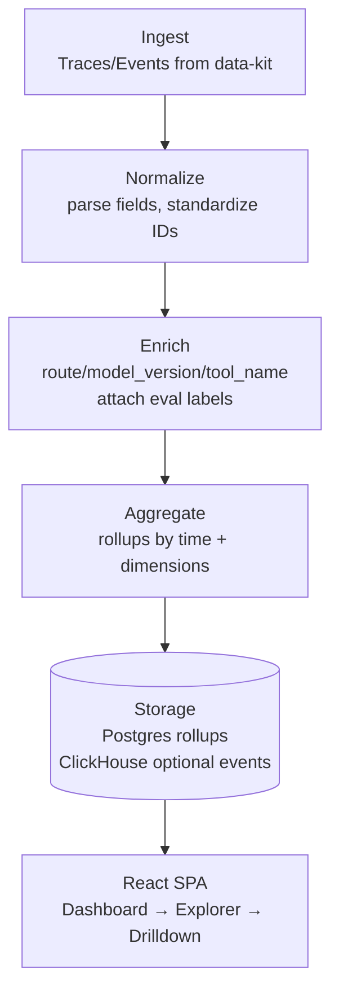
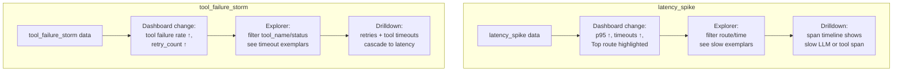

# Architecture Diagrams - learn-llm-observatory

## System Pipeline



## UI Screen Flow

```mermaid
flowchart LR
  A1[Dashboard\nKPIs + Alerts + Trends] --> A2[Trace Explorer\nFilters + Facets + Table]
  A2 --> A3[Trace Drilldown\nTimeline + Tags + Evidence]
  A3 -->|Open Case| C[Create/Link Case\n(agentic-investigator)]
```

## Scenario-to-UI Expectations


